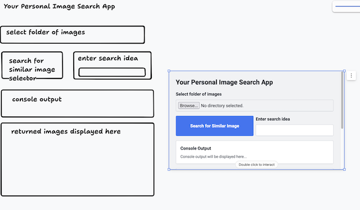
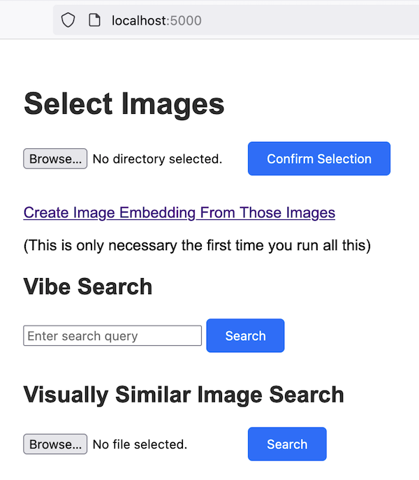

## readme

This is a project to create a personal image search engine around Simon Willison's [LLM-CLIP](https://github.com/simonw/llm-clip)

The interface was designed using makereal.tldraw.io

The html for that interface was passed to gpt-4o and told to just remember it as the desired end goal.

Then the basic use for llm-clip was passed to the model, asking the model to generate code from that starting point, appropriate to the desired interface.

This did not work worth a damn. ([This experiment worked marginally better](https://github.com/shawngraham/text-to-kg).)

So I gave GPT an ipynb notebook that did what I wanted, and told it to derive a flask app, one function at a time. That worked marginally better. If I was a better coder, I wouldn't have done things like that. On the other hand, without gpt, working in small chunks, I would not have attempted this _at all_.

The result is this flask app. Make a new environment on your computer, activate it, then:

```
pip install flask
pip install -U flask-cors
pip install llm
llm install llm-clip
```

If you want to use this with a custom transfer-trained CLIP model, and it's available on Huggingface, make sure you have `pip install transformers` and then work out where llm-clip.py is located:

```!pip list -v | grep llm```

and change lines 22 and 23:

```
if self._model is None:
   self._model = SentenceTransformer('clip-ViT-B-32')
```

to the repo and model name, eg:

```
if self._model is None:
	self._model = SentenceTransformer('sgraham/archae-ai')
```

## to run

```$ python app.py```

Go to [https://localhost:5000](https://localhost:5000)

## to use

Select the folder with all your images; these will be embedded. Then you can use the similar image search to compare new images to your collection and pull up the five most similar. Or you can search for a particular 'vibe' through text, eg `dogs playing poker` and it will return those images in your collection most similar to that idea.

### The idea:



### The realization:

